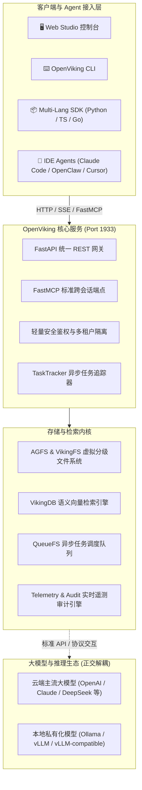

# ⚔️ OpenViking Studio

<div align="center">

**面向多 Agent 系统的专业级全景座舱、层次化上下文数据库与实时遥测工作台**

[](https://github.com/skloxo/OpenVikingStudio)
[](https://github.com/skloxo/OpenVikingStudio)
[](https://github.com/skloxo/OpenVikingStudio)
[](https://github.com/skloxo/OpenVikingStudio)
[](https://github.com/skloxo/OpenVikingStudio)
[](LICENSE)

[项目特性](#-核心特性) | [系统架构](#-系统架构拓扑) | [演进蓝图](#-未来演进蓝图-roadmap) | [快速上手](#-快速上手-quick-start) | [开源说明](#-开源开源与致敬)

</div>

---

## 🌟 什么是 OpenViking Studio？

**OpenViking Studio** 是基于开源 [OpenViking (volcengine/OpenViking)](https://github.com/volcengine/OpenViking) 深度演进打造的**专业级多智能体全景座舱与上下文控制台 (Multi-Agent Context Cockpit & Observability Console)**。

OpenViking 原项目是由**火山引擎 / 字节跳动团队**开源的下一代 Agent-Native 层次化上下文数据库。在此坚实基座之上，**OpenViking Studio** 专注于解决多 Agent 长程交互中的**“状态不可见、上下文易遗忘膨胀、交互黑盒难以追踪、调试排障成本高”**等工程痛点，为开发者和各类智能体提供开箱即用、高密清晰的可视化观测与治理体验：

- 🧠 **跨会话持久化体外大脑 (`viking://`)**：统一收口长程记忆、开发者偏好、工程决策与踩坑教训；
- ⚡ **L0 / L1 / L2 层次化分级检索**：支持毫秒级摘要拦截 (Abstract)、SOP 流程概览 (Overview) 到精准切片 (Detail) 的分层召回；
- 📊 **座舱级实时遥测大盘 (Telemetry Console)**：多维度精确审计 Token 消耗分布（VLM / Embedding / Rerank）、检索成功率以及会话上下文写入热力图；
- 🖥️ **沉浸式实验场与工作台 (`/playground`)**：提供全景资源文件树、分级预览画布、多轮会话回溯与工程技能索引；
- 🔌 **标准 FastMCP 智能体桥梁**：原生无缝对接 Claude Code、Cursor、OpenClaw 等主流 Agent 客户端，实现零成本插拔接入。

---

## ✨ 核心特性

### 1. 🖥️ 全景 Web Studio 沉浸式座舱
- **智能实验场 (`/playground`)**：整合资源库与沙箱，提供上下文目录树、L0/L1/L2 分级实时预览与时间线回溯；
- **任务中心真实吞吐看板 (`/tasks`)**：微观工序与宏观业务双轨展示，以严密的物理完成契约追踪分片并发进度，杜绝静态假死；
- **长程会话追踪器 (`/sessions`)**：支持跨会话历史上下文回溯，结构化呈现消息流、工具调用与提取的记忆切片；
- **技能控制中心 (`/skills`)**：配置化驱动发现与索引全域技能，支持 TOC 结构化索引与源码快速调阅。

### 2. 📊 高密座舱视觉与零虚假数据治理
- **克制性冷淡工业设计**：严格遵循信号语义色彩规范，关键数值采用等宽字体高密对齐，杜绝无意义装饰噪音；
- **100% 物理真实数据驱动**：前后端数据严丝合缝，彻底消除前端伪造数字或硬编码 Mock，接口无数据时优雅降级。

### 3. 🛡️ 稳固解耦的模型与运行时架构
- **计算与存储完全正交**：系统关注上下文数据库、向量检索与记忆持久化，与外部大模型完全解耦；
- **全协议兼容**：无论使用云端主流商业模型，还是本地私有化推理引擎（如 Ollama、vLLM），均可通过标准接口无缝接入，零硬件绑定门槛。

---

## 🏛️ 系统架构拓扑 (Architecture Topology)



---

## 🗺️ 未来演进蓝图 (Roadmap)

我们秉持第一性原理，持续推进面向多 Agent 复杂长程任务的自愈与进化生态：

```text
阶段一：核心基座与座舱观测 (Foundation & Observability)   [已完成]
├─ 深度兼容 OpenViking 原生内核、AGFS 虚拟文件系统与 FastMCP 协议
├─ 现代化 Web Studio 座舱：实验场全屏画布、技能管理、会话历史回溯
└─ 实时系统遥测大盘：精准 Token 分类审计 (Embedding / Rerank / VLM)、上下文热力图

阶段二：自适应语义压缩与双层运行时 (Adaptive Loop & Compression) [进行中]
├─ 两层事件循环架构 (Two-Tier Agent Loop)：外层生命周期重试护卫 + 内层工具链快速收敛
├─ 状态快速感知器：基于 Merkle Tree 结构实现亚毫秒级上下文哈希变更检测
├─ 智能上下文脱水矩阵：自适应长文本切片与语义无损提纯，杜绝长程会话 Token 膨胀
└─ 客户端弹性防护：完善 404 失效轮询熔断与网络抖动退避机制

阶段三：自主进化飞轮与智能体网格 (Evolution Flywheel & Agent Mesh) [规划中]
├─ 踩坑经验自动结晶 (Self-Evolving Flywheel)：Agent 解决复杂工程难题后自动提取 SOP 存入体外大脑
├─ 多 Agent 对等协作网格：支持跨节点、跨工作区的无缝记忆流交换与分布式联合检索
└─ 企业级零信任安全隔离：敏感凭据自动化阻断防御与细粒度租户权限体系
```

---

## 🌐 标准服务端口矩阵 (SSOT Service Matrix)

| 服务名称 | 端口 | 角色与功能 | 协议与入口 | 常驻推荐管理方式 |
| :--- | :--- | :--- | :--- | :--- |
| **OpenViking 核心服务** | **`1933`** | 统一 REST API、FastMCP 端点与内嵌 Web Studio | `http://127.0.0.1:1933` | `systemctl --user restart openviking.service` |
| **Web Studio 开发服务** | **`1936`** | 前端 Vite 热更开发与测试工作台（可选） | `http://127.0.0.1:1936` | `pnpm run dev` |

---

## ⚡ 快速上手 (Quick Start)

### 1. 克隆仓库与安装依赖

```bash
git clone https://github.com/skloxo/OpenVikingStudio.git
cd OpenVikingStudio

# 安装 Python 后端核心引擎 (建议在虚拟环境中执行)
pip install -e .

# 安装前端 Web Studio 依赖
pnpm install
```

### 2. 启动服务

```bash
# 1. 启动后端核心引擎 (默认监听 1933 端口)
openviking-server --config ~/.openviking/ov.conf --host 0.0.0.0 --port 1933

# 2. 启动前端开发调试工作台 (Port 1936，生产环境可直接访问 1933/studio)
pnpm run dev
```

浏览器打开 `http://127.0.0.1:1936`，即刻进入 OpenViking Studio 全景控制台。

### 3. 运行质量保障测试

```bash
# 运行后端全量单元与检索测试 (2,170+ 项用例)
pytest tests/unit tests/parse tests/agfs

# 前端生产打包校验
npm run build
```

---

## 🤝 开源致敬与说明

- **内核致敬**：感谢火山引擎开源的 [OpenViking](https://github.com/volcengine/OpenViking) 核心体系，为大模型 Agent 上下文管理树立了优秀的规范与基础。
- **定位原则**：本项目作为社区深度演进的控制台与工作台版本，坚持与上游协议 100% 兼容，代码高内聚、依赖极简、向光演进。

---

## 📄 许可证 (License)

本项目基于 [Apache-2.0 License](LICENSE) 协议开源。
