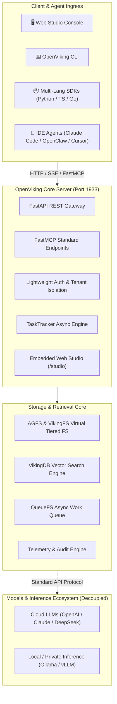

# ⚔️ OpenViking Studio

<div align="center">

**Professional Cockpit, Hierarchical Context Database & Real-Time Telemetry Workstation for Multi-Agent Systems**

[](https://github.com/skloxo/OpenVikingStudio)
[](https://github.com/skloxo/OpenVikingStudio)
[](https://github.com/skloxo/OpenVikingStudio)
[](https://github.com/skloxo/OpenVikingStudio)
[](https://github.com/skloxo/OpenVikingStudio)
[](LICENSE)

[Roadmap](#-strategic-roadmap) | [Architecture](#-architecture-topology) | [Core Features](#-core-features) | [Quick Start](#-quick-start) | [Upstream](#-upstream-acknowledgment)

</div>

---

## 🌟 What is OpenViking Studio?

**OpenViking Studio** is a professional **Multi-Agent Context Cockpit & Observability Console** deeply evolved from the open-source [OpenViking (volcengine/OpenViking)](https://github.com/volcengine/OpenViking) project.

The original OpenViking project was open-sourced by **ByteDance / Volcano Engine** as a next-generation Agent-Native hierarchical context database. Building on this solid foundation, **OpenViking Studio** addresses critical engineering challenges in multi-agent environments—such as context bloat, memory loss, opaque black-box execution, and debugging complexity:

- 🧠 **Cross-Session Exocortex Memory (`viking://`)**: Centralized storage for persistent memories, developer preferences, decisions, and evolution lessons.
- ⚡ **L0 / L1 / L2 Hierarchical Semantic Retrieval**: Multi-tier recall from millisecond Abstract interception and Overview SOP guidance to fine-grained Detail slices.
- 📊 **Cockpit-Grade Real-Time Telemetry**: Granular token audit breakdown (VLM / Embedding / Rerank), query success rates, and context commit heatmaps.
- 🖥️ **Interactive Playground & Workstation (`/playground`)**: Focus Canvas view, context directory tree, timeline diffs, and full engineering skill index.
- 🔌 **Standard FastMCP Agent Integration**: Native plug-and-play support for Claude Code, Cursor, OpenClaw, and modern agent harnesses.

---

## 🗺️ Strategic Roadmap

| Milestone Phase | Strategic Focus & Key Initiatives | Delivery Status |
| :--- | :--- | :--- |
| **Phase 1: Foundation & Observability** | <ul><li>**Core Engine Alignment**: Full support for AGFS virtual filesystem, VikingDB, and standard FastMCP</li><li>**Immersive Web Studio**: Focus Canvas, multi-turn session history diffs, and skill catalog</li><li>**Telemetry Dashboard**: Precision token classification (Embedding / Rerank / VLM) and context heatmaps</li><li>**Monorepo Consolidation**: Unified repo for backend, Web Studio, and multi-language SDKs</li></ul> | `✅ Delivered` |
| **Phase 2: Deterministic Loop & Compression** | <ul><li>**Two-Tier Agent Loop**: Outer lifecycle/retry protection + inner tool convergence loop & cooperative abort</li><li>**$\Pi$ State Change Sensor**: Sub-millisecond ($< 2\text{ms}$) context Merkle Tree delta detection</li><li>**Adaptive Context Dehydration**: Semantic distillation matrix preventing token bloat in long sessions</li><li>**Client Resiliency Guard**: Automated circuit-breaking for orphan session 404 polling & backoff</li></ul> | `⚡ Active` |
| **Phase 3: Self-Evolving Flywheel & Mesh** | <ul><li>**Self-Evolving Lesson Extraction**: Automatically crystallize lessons into reusable SOP memories</li><li>**Multi-Agent Federation Mesh**: Cross-node memory exchange and distributed federated search</li><li>**Zero-Trust Context Isolation**: Automated credential leak defense and fine-grained tenant RBAC</li></ul> | `🔮 Planned` |

---

## 🏛️ Architecture Topology



---

## ✨ Core Features

### 1. 🖥️ Interactive Web Studio Cockpit
- **Intelligent Playground (`/playground`)**: Focus Canvas view, context directory tree, L0/L1/L2 real-time preview, and timeline diffs.
- **Task Center Real Throughput (`/tasks`)**: Dual-track presentation for micro-procedures and macro-tasks with strict completion contracts.
- **Multi-Turn Session Tracker (`/sessions`)**: Retrospective history inspection, message flow rendering, and extracted memory cards.
- **Skill Control Center (`/skills`)**: Configuration-driven skill discovery, TOC structured navigation, and live code inspection.

### 2. 📊 High-Density Cockpit Design & Ground Truth
- **Restrained Industrial Design**: Strict signal color semantics, monospace tabular numbers, zero decorative noise.
- **100% Real Data Driven**: Front-to-back integrity with no mock numbers, graceful fallback on empty data.

### 3. 🛡️ Decoupled Model & Runtime Architecture
- **Storage-Compute Decoupling**: Pure focus on context storage, retrieval, and persistence, decoupled from specific LLMs.
- **Protocol Compatibility**: Seamless plug-in for commercial cloud APIs or private local inference engines.

---

## 🌐 Unified Port Matrix (SSOT)

Single port architecture adhering to Occam's Razor:

| Port | Role & Purpose | Protocol & Access | Recommended Service Management |
| :--- | :--- | :--- | :--- |
| **`1933`** | **OpenViking Core Server** (Unified REST API, FastMCP, and embedded Web Studio) | `http://127.0.0.1:1933`<br>Console: `http://127.0.0.1:1933/studio` | `systemctl --user restart openviking.service` |

---

## ⚡ Quick Start

### 1. Clone & Install

```bash
git clone https://github.com/skloxo/OpenVikingStudio.git
cd OpenVikingStudio

# Install backend core
pip install -e .

# Install frontend dependencies (optional, only needed for UI development)
pnpm install
```

### 2. Launch Server

```bash
# Start backend engine (unified on port 1933)
openviking-server --config ~/.openviking/ov.conf --host 0.0.0.0 --port 1933
```

Access **`http://127.0.0.1:1933/studio`** directly in your browser to use the OpenViking Studio Cockpit.

### 3. Verification & Tests

```bash
# Run backend test suite (2,170+ test cases)
pytest tests/unit tests/parse tests/agfs

# Verify production frontend build
npm run build
```

---

## 🤝 Upstream Acknowledgment

- **Core Engine**: Sincere gratitude to ByteDance / Volcano Engine for open-sourcing [OpenViking](https://github.com/volcengine/OpenViking), establishing a state-of-the-art foundation for agent context management.
- **Project Scope**: OpenViking Studio serves as a community-driven cockpit and workstation extension, adhering strictly to 100% upstream protocol compatibility, high cohesion, and minimal dependencies.

---

## 📄 License

Licensed under the [Apache-2.0 License](LICENSE).
