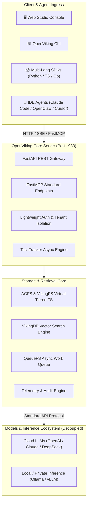

# ⚔️ OpenViking Studio

<div align="center">

**Professional Cockpit, Hierarchical Context Database & Real-Time Telemetry Workstation for Multi-Agent Systems**

[](https://github.com/skloxo/OpenVikingStudio)
[](https://github.com/skloxo/OpenVikingStudio)
[](https://github.com/skloxo/OpenVikingStudio)
[](https://github.com/skloxo/OpenVikingStudio)
[](https://github.com/skloxo/OpenVikingStudio)
[](LICENSE)

[English](./README_EN.md) | [中文说明](./README.md)

</div>

---

## 🌟 What is OpenViking Studio?

**OpenViking Studio** is a professional **Multi-Agent Context Cockpit & Observability Console** deeply evolved from the open-source [OpenViking (volcengine/OpenViking)](https://github.com/volcengine/OpenViking) project.

The original OpenViking project was open-sourced by **ByteDance / Volcano Engine** as a next-generation Agent-Native hierarchical context database. Building on this solid foundation, **OpenViking Studio** addresses critical engineering challenges in multi-agent environments—such as context bloat, memory loss, opaque black-box execution, and debugging complexity:

- 🧠 **Cross-Session Exocortex Memory (`viking://`)**: Centralized storage for persistent memories, developer preferences, decisions, and evolution lessons.
- ⚡ **L0 / L1 / L2 Hierarchical Semantic Retrieval**: Multi-tier recall from millisecond Abstract interception and Overview SOP guidance to fine-grained Detail slices.
- 📊 **Cockpit-Grade Real-Time Telemetry**: Granular token audit breakdown (VLM / Embedding / Rerank), query success rates, and context commit heatmaps.
- 🖥️ **Interactive Playground & Workstation (`/playground`)**: Focus Canvas view, context directory tree, timeline diffs, and full engineering skill index.
- 🔌 **Standard FastMCP Agent Integration**: Native plug-and-play support for Claude Code, Cursor, OpenClaw, and modern agent harnesses.

---

## 🏛️ Architecture Topology



---

## 🗺️ Roadmap

```text
Phase 1: Foundation & Cockpit Observability [Completed]
├─ Deep alignment with OpenViking core, AGFS virtual filesystem & FastMCP
├─ Modern Web Studio cockpit: interactive playground, session history, skill index
└─ Real-time telemetry: granular token audit (Embedding / Rerank / VLM), context heatmaps

Phase 2: Adaptive Compression & Two-Tier Runtime [In Progress]
├─ Two-Tier Agent Loop: outer lifecycle/retry guard + inner tool convergence loop
├─ Sub-millisecond state sensing: Merkle Tree hash change sensor (< 2ms)
├─ Intelligent context dehydration: adaptive slicing & loss-free semantic distillation
└─ Client-side resiliency: session 404 polling circuit-breakers & backoff guards

Phase 3: Autonomous Evolution & Agent Mesh [Planned]
├─ Self-Evolving Flywheel: automated lesson extraction & SOP memory crystallization
├─ Multi-Agent Federation Mesh: cross-node memory sync & distributed retrieval
└─ Enterprise Zero-Trust Isolation: credential guardrails & RBAC context scoping
```

---

## ⚡ Quick Start

### 1. Clone & Install

```bash
git clone https://github.com/skloxo/OpenVikingStudio.git
cd OpenVikingStudio

# Install backend core
pip install -e .

# Install frontend dependencies
pnpm install
```

### 2. Launch Services

```bash
# Start backend engine (default: 1933)
openviking-server --config ~/.openviking/ov.conf --host 0.0.0.0 --port 1933

# Start Web Studio dev server (1936; production bundled at 1933/studio)
pnpm run dev
```

Visit `http://127.0.0.1:1936` to enter the OpenViking Studio Cockpit.

### 3. Verification & Tests

```bash
# Run backend test suite (2,170+ test cases)
pytest tests/unit tests/parse tests/agfs

# Verify production frontend build
npm run build
```

---

## 🤝 Upstream Acknowledgment

- **Core Engine**: Sincere gratitude to ByteDance / Volcano Engine for open-sourcing [OpenViking](https://github.com/volcengine/OpenViking), establishing a state-of-the-art foundation for agent context management.
- **Project Scope**: OpenViking Studio serves as a community-driven cockpit and workstation extension, adhering strictly to 100% upstream protocol compatibility, high cohesion, and minimal dependencies.

---

## 📄 License

Licensed under the [Apache-2.0 License](LICENSE).
