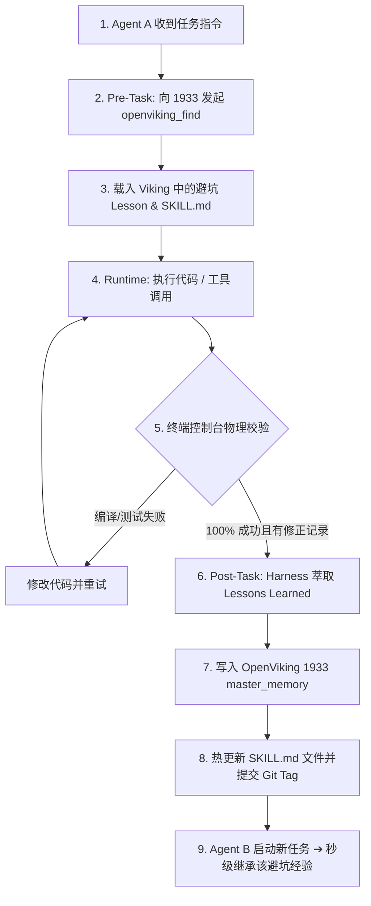
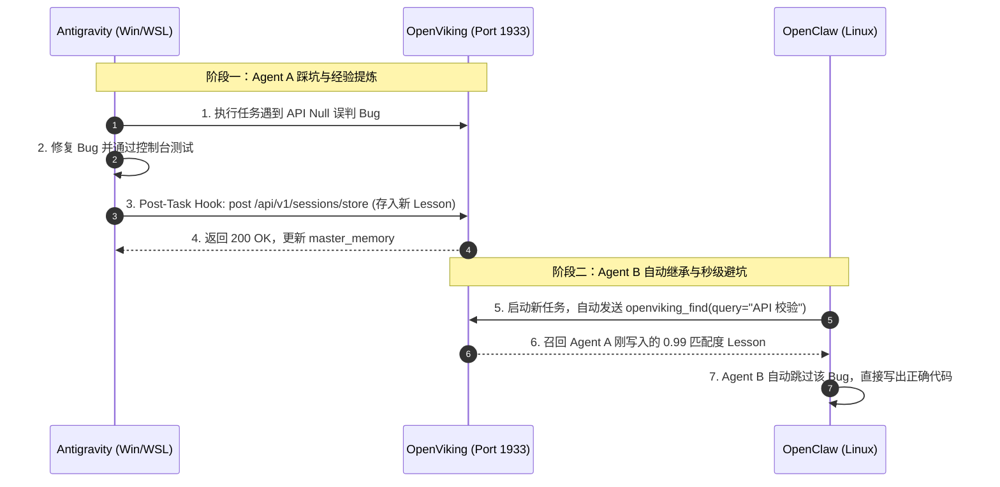

# Harness 自进化架构规范与多 Agent 交互设计 (Harness Evolution Architecture Specification)

本文档详细记录了在多智能体 (Multi-Agent) 与跨节点 (Windows / WSL / Linux) 环境下，**Harness 战衣外骨骼规范** 与 **OpenViking 1933 记忆中枢** 的自进化闭环设计。作为 Task Cards v1.1.38 ~ v1.1.41 的物理实施依据。

---

## 一、 系统架构与组件定位 (System Architecture & Roles)

1. **OpenViking 1933 (中央大脑与记忆中枢 / Single Source of Truth)**:
   - 托管全量 1.7GB 向量数据库 (cuVS + Qwen3-Embedding-8B + qwen3-reranker-0.6b)。
   - 提供 `master_memory` 存储与 85 个技能规范的 API 统一调度。
   - 暴露标准的 FastMCP 与 HTTP REST 接口，不进行任何后台外挂死循环轮询。

2. **Harness 战衣规范层 (Harness Specification Layer)**:
   - 为每个 Agent（Antigravity、OpenClaw、Hermes）提供统一的四阶段执行与演进 Hook。
   - 保证零大模型参数微调，依靠纯外部规则 (`SKILL.md`) 与内存/向量索引实现毫秒级自进化。

3. **多智能体实例 (Multi-Agent Instances)**:
   - **Antigravity IDE**: 运行在 Windows / WSL 环境。
   - **OpenClaw**: 运行在 Linux 宿主环境。
   - **Hermes**: 运行在 Linux 宿主环境。
   - 每一个 Agent 请求 OpenViking 时均携带统一 HTTP Header 标识：
     - `X-OpenViking-Actor-Peer`: `antigravity` / `openclaw` / `hermes`
     - `X-OpenViking-Node-ID`: `win-2080ti` / `wsl-ubuntu` / `linux-host`

---

## 二、 系统架构与拓扑图 (Architecture Topology)

```mermaid
graph TD
    subgraph 中央大脑与规则中枢 [OpenViking Central Hub - Port 1933]
        OV_Mem[(Master Memory 1.7GB 向量库)]
        OV_Skills[85 个 SKILL.md 技能中心]
        OV_API[FastMCP & REST API 网关]
    end

    subgraph Harness 外骨骼规范层 [Harness Engine Specification]
        H_Pre[Pre-Task: 自动召回 Hook]
        H_Run[Runtime: 控制台日志捕获]
        H_Post[Post-Task: 避坑经验萃取]
    end

    subgraph 多智能体个体 [Multi-Agent Instances]
        Agent_AG[Antigravity IDE - WSL/Win]
        Agent_OC[OpenClaw Agent - Linux]
        Agent_HM[Hermes Agent - Linux]
    end

    Agent_AG -->|穿戴套用| Harness 外骨骼规范层
    Agent_OC -->|穿戴套用| Harness 外骨骼规范层
    Agent_HM -->|穿戴套用| Harness 外骨骼规范层

    Harness 外骨骼规范层 <==>|双向同步 X-OpenViking-Actor-Peer| OV_API
    OV_API <--> OV_Mem
    OV_API <--> OV_Skills
```

---

## 三、 自进化 Loop 数据流 (Self-Evolution Data Flow)



---

## 四、 多 Agent 跨节点交互时序图 (Interaction Sequence Diagram)



---

## 五、 落地实现四大规范 (Implementation Guidelines)

1. **Pre-Task 战衣组装 (Cold-Start Recall)**:
   - 任何 Agent 接到任务后，首先隐式向 `http://127.0.0.1:1933/api/v1/search/find` 查询相关的历史 `Lessons`。
   - 将召回的 top-K 高相似度（Score ≥ 0.85）避坑规则注入 Prompt 头部。

2. **Runtime 实证校验 (Grounded Verification)**:
   - 拒绝大模型空想自我打分。
   - 只有终端命令行返回 `Exit Code 0`、`Build Success` 或 `Unit Tests 100% Passed` 的任务才被认定为有效经验。

3. **Post-Task 经验萃取 (Lesson Extraction Schema)**:
   - 提取格式必须为结构化 Markdown / JSON 摘要：
     ```json
     {
       "has_new_lesson": true,
       "target_skill": "diagnosing-bugs",
       "issue": "问题现象简述",
       "avoidance_rule": "避坑指南与正确规则",
       "code_snippet": "正确代码范例"
     }
     ```

4. **Evolution 写入与防死锁护栏 (Hot Refine Guardrails)**:
   - 写入动作直接在 API 响应结束前触发，绝不使用死循环轮询后台脚本。
   - 对 `SKILL.md` 的修改通过 Git 递增记录 (`git commit -m "chore(harness): evolve skill <name> with lesson"`).
