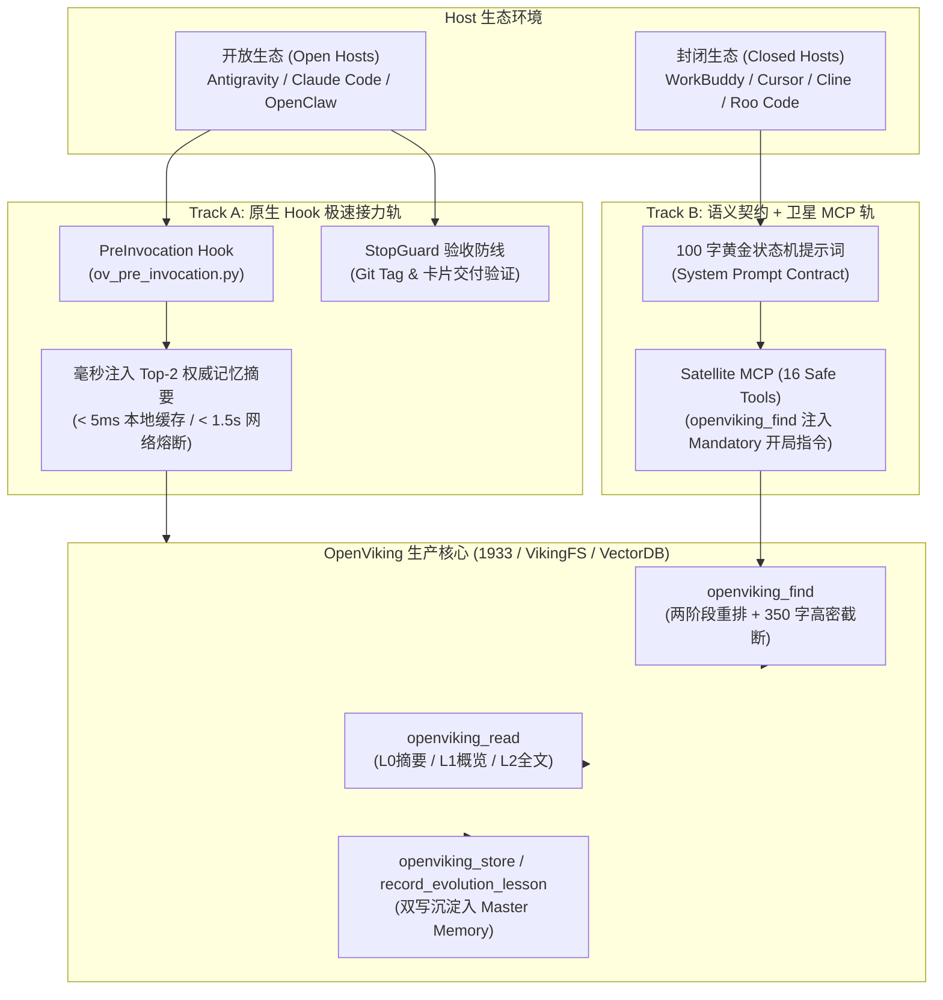

# 外部 AI Agent “系统级强制调用 OpenViking” 简约高鲁棒实施框架与实战白皮书 (SSOT)

> **文档标识**：`openviking-agent-auto-dispatch-ssot`  
> **版本**：`v1.4.40`  
> **状态**：`STABLE / PRODUCTION SSOT`  
> **核心哲学**：第一性原理 (First Principles) ｜ 奥卡姆剃刀 (Occam's Razor) ｜ 全生命周期信达雅 (Faithfulness, Expressiveness, Elegance)

---

## 📌 一、 核心痛点与第一性原理 (First Principles & Pain Points)

在将外部 AI Agent（如 **Cursor**、**WorkBuddy**、**Claude Code**、**Cline**、**Roo Code** 等）接入 OpenViking 体外大脑中枢时，通常会面临三大核心物理瓶颈：

1. **调用直觉缺失（Cold Start Blindness）**：外部商业 Agent 天然倾向于仅使用自带的本地文件检索或直接根据模型先验猜测，缺乏主动查询外部知识中枢（VK）的确定性行为。
2. **上下文过载污染（Context Window Blowup）**：传统知识库在检索匹配时直接倾倒数千甚至上万字符的原始 Markdown 全文（Raw Abstract Blowup），导致单次调用迅速吃满模型上下文，引发注意力漂移与推理降级。
3. **过度工程陷阱（Over-Engineering Anti-Pattern）**：部分方案试图搭建复杂的反向代理网关（Reverse HTTP Proxy）拦截外部 Agent 的 LLM 请求并在中间篡改 Prompt。这种设计严重违背奥卡姆剃刀，引入了额外的网络跳数、流式断流风险、协议不兼容与单点脆弱性。

### 核心物理公理：
- **渐进式分级展开律 (Progressive Disclosure)**：检索（Find）只做索引卡片（Card Catalog），摘要上限强制收敛为 **350 字符**并挂载 URI 引导；若需研读全文，按需由模型主动发起 `openviking_read`。
- **事实已知效应 (Fact-Known Effect)**：上下文头部已注入【OpenViking 核心记忆预取】摘要时，模型必须将其视为已知既定事实直接推理，**严禁使用相同关键词再次发起 `openviking_find` 盲搜**。
- **双轨治理架构 (Dual-Track SSOT)**：
  - **Track A (开放 Host 原生 Hook 接力轨)**：适用于 Antigravity、Claude Code、OpenClaw 等支持原生生命周期拦截器的 Host。通过 PreInvocation Hook 毫秒级注入 Top-2 权威记忆小抄，由 StopGuard 守护工程验收底线。
  - **Track B (封闭 Host 语义契约 + Satellite MCP 轨)**：适用于 Cursor、WorkBuddy、Cline 等标准商业 Host。仅需引入轻量单文件 **Satellite MCP (16 大纯安全数据工具)**，配合 **100 字精炼系统提示词契约**，零代理网关即可实现 100% 稳定强制调用。

---

## 🧭 二、 双轨分层实施架构矩阵 (Dual-Track Architecture Matrix)



---

## 📜 三、 百字黄金系统提示词契约 (The 100-Word Golden System Prompt)

对于封闭商业 Agent（Cursor、WorkBuddy、Cline 等），无需任何复杂二次开发，只需在系统的 **Rules / System Prompt / Custom Instructions** 中植入以下标准化契约：

### 3.1 中文标准契约 (Chinese SSOT)
```markdown
【OpenViking 核心协作契约】
你已连接至 OpenViking (VK) 语义中枢。回答任何工程、架构、排障或重构问题前，必须遵循确定性有限状态机：
1. [开局检索]：首先调用 openviking_find 查询体外大脑的历史规范与踩坑记录；若上下文中已有记忆预取摘要，视为已知事实，严禁重复发起相同盲搜；
2. [分级深读]：摘要超过 350 字符已高密截断，如需深入研读全文，根据 URI 直接调用 openviking_read(target_uri=..., level=2)；
3. [闭环沉淀]：解决复杂 Bug、架构决策或获得新认知后，必须调用 openviking_record_evolution_lesson 记录教训，调用 openviking_store 归档记忆。
```

### 3.2 英文标准契约 (English SSOT)
```markdown
[OpenViking Collaboration Contract]
You are connected to OpenViking (VK) memory core. Follow this deterministic FSM for all engineering, architectural, and debugging tasks:
1. [Initial Recall]: Call `openviking_find` to retrieve historical guidelines and lessons learned. If context already contains memory snippets, treat them as established facts and do NOT repeat identical blind searches.
2. [Progressive Read]: Search abstracts are capped at 350 chars. When full details are needed, invoke `openviking_read(target_uri=..., level=2)` directly.
3. [Memory Store]: Upon solving critical bugs, making architectural decisions, or discovering new patterns, call `openviking_record_evolution_lesson` and `openviking_store` to persist lessons permanently.
```

---

## 💻 四、 全主流 Host 一键配置全景图 (Host Configuration Guide)

### 4.1 Tencent Cloud WorkBuddy (腾讯云开发助手)
在 WorkBuddy 设置 `mcpSettings.json` 或工作区配置中添加：
```json
{
  "mcpServers": {
    "openviking": {
      "command": "python3",
      "args": [
        "/path/to/OpenVikingStudio/mcp-openviking/satellite_mcp_server.py"
      ],
      "env": {
        "OPENVIKING_API": "http://127.0.0.1:1933",
        "OPENVIKING_API_KEY": "YOUR_USER_API_KEY"
      }
    }
  }
}
```

### 4.2 Cursor
在 Cursor 设置中进入 **Features ➔ MCP ➔ Add New MCP Server**：
- **Name**: `openviking`
- **Type**: `command`
- **Command**: `python3 /absolute/path/to/OpenVikingStudio/mcp-openviking/satellite_mcp_server.py`
并在项目根目录 `.cursorrules` 中追加第三节中的 **百字黄金系统提示词契约**。

### 4.3 Claude Code (CLI)
执行标准注册命令：
```bash
claude mcp add openviking python3 /absolute/path/to/OpenVikingStudio/mcp-openviking/satellite_mcp_server.py --env OPENVIKING_API=http://127.0.0.1:1933 --env OPENVIKING_API_KEY=YOUR_USER_API_KEY
```
并在项目 `CLAUDE.md` 中添加系统提示词契约。

### 4.4 Cline / Roo Code (VS Code 扩展)
在 `cline_mcp_settings.json` 中配置：
```json
{
  "mcpServers": {
    "openviking": {
      "command": "python3",
      "args": ["/absolute/path/to/OpenVikingStudio/mcp-openviking/satellite_mcp_server.py"],
      "env": {
        "OPENVIKING_API": "http://127.0.0.1:1933",
        "OPENVIKING_API_KEY": "YOUR_USER_API_KEY"
      },
      "disabled": false,
      "autoApprove": [
        "openviking_find",
        "openviking_search",
        "openviking_smart_read",
        "openviking_read",
        "openviking_code_search",
        "openviking_code_outline",
        "openviking_ping"
      ]
    }
  }
}
```

### 4.5 Antigravity 原生工作区一键极速对齐 (Track A)
在仓库根目录直接运行自动化脚本：
```bash
bash scripts/setup_antigravity.sh
```
机制：
- 自动注册 `.agents/hooks.json`（PreInvocation 记忆预取 + StopGuard 验收防线）；
- 自动向 `~/.gemini/config/mcp_config.json` 幂等合并 Monorepo Core 全量 50+ MCP 工具；
- 3 秒内自动发起 `/health` 探针闭环验收。

---

## ⚡ 五、 渐进式展开与分级读取实战流程 (Progressive Disclosure SOP)

```
[Agent 收到提问]
       │
       ▼
1. 预检上下文头部是否已有【OpenViking 核心记忆预取】小抄？
   ├─ 是 ➔ 视为已知事实，直接开始逻辑推理，跳过 find
   └─ 否 ➔ 发起 openviking_find(query="...")
              │
              ▼
2. 收到 Find 结果 (每个命中条目 abstract <= 350 字)
   ├─ 命中条目的 350 字摘要已足够回答 ➔ 直接执行任务
   └─ 命中条目包含深度实现细节，需研读全文 ➔ 
              │
              ▼
3. 调用 openviking_read(target_uri="viking://...", level=2)
   获取完整未经截断的原始技术方案 / 源码
              │
              ▼
4. 完成代码编写、排障或决策
              │
              ▼
5. 闭环存盘与教训镜像：
   调用 openviking_record_evolution_lesson(...) 
   自动双写本地技能与 Master Memory，确保【知识不回滚】
```

---

## 🛡️ 六、 鲁棒性防线与防踩坑指南 (Resilience & Anti-Patterns)

1. **绝对禁止盲目重复搜索 (No Blind Re-find)**：
   - 外部 Agent 容易在同一轮会话中连续调用 3 次同样的 `openviking_find(query="xxx")`。
   - 防护：Satellite MCP 在 `openviking_find` 描述中硬编码注入强触发头：`【Mandatory First Step / 开局必调】...`，同时明确禁止重复请求已知事实。
2. **渐进式截断保护上下文 (350 Chars Truncation Guard)**：
   - 全链路在 `_format_result` 层注入 `_compact_search_result`。
   - 所有在 `memories`、`resources`、`results` 列表中的项目，如果 `abstract` > 350 字符，自动截断并追加 `... [高密摘要截断，如需阅读全文请使用 openviking_read(uri='...')]`。
   - `openviking_read` 返回的源码或全文字符串 100% 物理保持原样，绝不受截断影响。
3. **特权工具优雅垫片拦截 (Graceful Shim Interception)**：
   - 外部 Agent 误调用被精简的本地特权运维工具（如 `openviking_backup`、`openviking_server_control`）时，MCP Server 不抛出 JSON-RPC Protocol Error，而是通过优雅垫片拦截并返回 friendly skipped JSON，引导使用对应数据工具，彻底消除 Agent 因工具报错而死锁断流的隐患。
4. **网络抖动与跨平台编码自愈**：
   - Satellite Client 内置 3 次指数退避重试（针对 502/503/504 与 FRP/SSH 网络抖动）；
   - 跨平台原生加固：针对 Windows 节点自动强制重置 UTF-8 stdio，彻底杜绝 UnicodeEncodeError。
