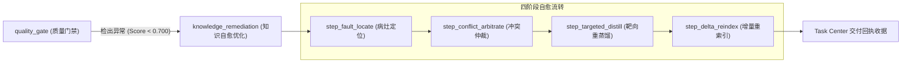

# 🛡️ OpenViking 知识熵增治理、自愈流水线与检索评测架构白皮书 (SSOT)

> **关联主看板**：[`REFACTORING_PLAN.md`](file:///home/skloxo/aho/openclaw/project/OpenVikingStudio/REFACTORING_PLAN.md) ｜ **大蓝图**：[`.agents/BLUEPRINT.md`](file:///home/skloxo/aho/openclaw/project/.agents/BLUEPRINT.md)  
> **生效版本**：v1.4.60+ ｜ **定位**：抗熵增质量门禁、四阶段自愈优化流水线与检索大屏 KPI 唯一技术设计真相源。

---

## 📌 一、 检索大屏核心 KPI 指标规范 (Retrieval KPI Matrix)

首屏采用高密性冷淡设计，严格封杀绿色，以冰青 (`cyan-500`)、沉静灰 (`muted`)、玫瑰红 (`rose-500`) 传递三态语义：

| 指标名称 | 物理意义与计算逻辑 | 当前基线 | 达标红线 | 进阶目标 |
| :--- | :--- | :---: | :---: | :---: |
| **RAGAS 综合指数** | Context Relevance、Faithfulness、Answer Semantic Similarity 的调和均值 | `0.820` | $\ge 0.700$ | $\ge 0.920$ |
| **平均检索耗时** | 向量粗排耗时与 Cross-Encoder Reranker 重排耗时之和 | `18.4ms` | $\le 50.0\text{ms}$ | $\le 8.0\text{ms}$ |
| **金标命中召回率** | 标准金标测试集 (Ground Truth) Top-3 命中完整率 | `100.0%` | $\ge 90.0\%$ | $100.0\%$ |
| **上下文纯净度** | 送入 LLM 的切片中有效技术事实与样板/废话词的比例 | `85.0%` | $\ge 80.0\%$ | $\ge 95.0\%$ |

---

## ⚙️ 二、 抗熵增质量门禁与自愈优化双轨流转机制

### 1. 质量门禁 (`quality_gate` - 探测端)
- **调度引擎**：`Semantic` 语义分析引擎；
- **底层算子链**：`[QuerySample] ➔ [VectorRetrieve] ➔ [RagasJudge] ➔ [MetricAssert]`；
- **物理进度度量**：严守 $X/Y$ 契约，完成才 $+1$，执行中展示真实已评测用例量。

### 2. 知识自愈优化 (`knowledge_remediation` - 治理端)
- **工序一：病灶定位 (`step_fault_locate`)**：定位引发未通过用例的根源切片 URI 与行号；
- **工序二：冲突仲裁 (`step_conflict_arbitrate`)**：按时间戳与权限层级判定过时废弃版本，打上 `superseded` 软标记；
- **工序三：靶向重蒸馏 (`step_targeted_distill`)**：调用微调模型去除切片杂质与矛盾表述；
- **工序四：增量重索引 (`step_delta_reindex`)**：局部增量重建 HNSW 向量索引，影子指针原子切换。

---

## 🛡️ 三、 三大防御机制与后续排期卡片 (Roadmap)

1. **`Card-Remediation-DLQ (v1.4.61)`**：
   - 死信队列 (DLQ)：限制 `max_retries = 2`，阻断死循环振荡风暴；
   - 快照可逆性：靶向蒸馏前必须 `VikingFS.commit` 快照，支持秒级原子回滚。
2. **`Card-Trigger-Daemon (v1.4.62)`**：
   - 落地累积写入 ($\ge 50$ Chunks)、凌晨低峰 Cron (03:00)、线上低分 (<0.45) 三级无头后台触发探针；
   - 动态金标采掘池：从真实请求日志动态提纯测试集，消除静态过拟合。
3. **`Card-Retrieval-Optimize (v1.4.63)`**：
   - 微软 LLMLingua-2 结构感知上下文脱水，固化参数保护代码块；
   - BM25 词法 + HNSW 向量互惠排序融合 (Hybrid RRF)；
   - L0 语义快照缓存 (Semantic Cache)。
