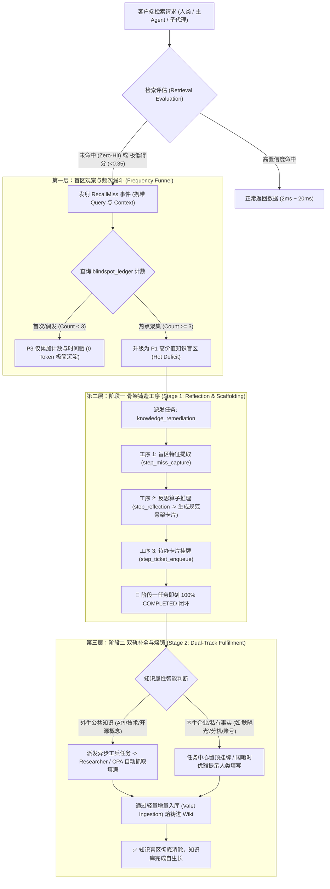

# 🧠 知识盲区自愈、反思骨架铸造与双轨补全自进化架构白皮书 (Knowledge Deficit Scaffolding Spec)

> **文档性质**：架构演进白皮书 ｜ **状态**：⏸️ 评估与沉淀中（择机迭代）  
> **关联工单**：[`REFACTORING_PLAN.md - Card-Knowledge-Scaffolding-Loop`](../../REFACTORING_PLAN.md)  
> **关联主蓝图**：[BLUEPRINT.md](../../.agents/BLUEPRINT.md) ｜ [MANAGED_INGESTION_AND_TASK_PIPELINE.md](MANAGED_INGESTION_AND_TASK_PIPELINE.md)

---

## 🧭 一、 架构背景与思想源起 (Origin & Paradigm Shift)

### 1.1 历史教训：洗澡水与婴儿
- **老版看门狗 (`entropy_watchdog.py`) 的死穴**：
  在 v1.4.76 之前，看门狗作为一个死循环后台守护线程，在每次文件写入 5 秒后，自动派发 5 道黄金大题造伪任务风暴（`auto-qg`），霸占 2080Ti 显存，刷爆 AGFS 任务队列，造成严重的任务刷屏与系统性能抖动。因此在 v1.4.76 中被彻底切除自动派发逻辑。
- **用户的第一性原理洞察**：
  在排查历史文件 `20260908_152123_watchdog_distill_倩倩.md` 时，用户敏锐地指出：**看门狗错在失控的并发与无脑的触发时机，但它产出的“反思报告与结构化脚手架”本身却极具工程价值！**
  当检索盲区发生时，系统如果能搭出一个包含实体类型、语义锚点、操作指南、JSON 槽位与 Mermaid 图谱骨架的“待填空卡片”，人类或后续智能体只需顺藤摸瓜填空，就能把体外大脑的缺失事实迅速补齐！

### 1.2 范式跃迁：从“独立守护进程”到“工序与算子”
- **彻底抛弃独立 Background Daemon**：绝不搞随时自作主张后台发疯的常驻监控进程；
- **降维归位于“任务工序 (Step Slot)”**：反思是流水线内标准、离散、受控的一道工序；
- **标准化为“算子引擎 (Engine Driver)”**：反思是由大模型或规则驱动的高内聚推理算子；
- **两阶段解耦**：骨架一旦铸造完成，该任务立即 `COMPLETED` 闭环，不产生长事务挂起。

---

## ⚖️ 二、 第一性原理与反“过度工程化”审视矩阵 (Anti-Overengineering Guardrails)

在正式排期开发前，必须用奥卡姆剃刀与真实工况严格审视该需求，坚决防止陷入过度工程化陷阱：

| 审视维度 | 潜在过度工程化陷阱（红线 🚫） | 第一性原理极简正确解法（绿灯 ✅） |
| :--- | :--- | :--- |
| **触发频率** | 只要检索未命中或打错一次字，就立刻弹窗发任务、派工兵跑爬虫，导致任务队列和人类被噪音淹没。 | **频次聚合观察池**：未命中仅累加计数 (`miss_count = 1`)，0 Token，0 进程，静默无感；仅高频 ($\ge 3$ 次) 才升级为攻坚任务。 |
| **任务生命周期** | 一个任务一直挂起为 `RUNNING`，等待人类填空或工兵爬完才结束，导致系统充斥大量僵死长任务。 | **两阶段物理解耦**：骨架卡片生成即 `COMPLETED`，补全属于下游独立任务或待办，绝不阻塞。 |
| **算力与网络开销** | 盲目调用大模型对每个错别字生成长篇大论，盲目派爬虫全网乱爬消耗 Token。 | **轻量规则初筛 + 分级路由**：外生公共概念才派工兵探索，内部企业人名/私有信息坚决不盲爬，精准求助人类。 |
| **代码实现侵入性** | 在底层数据库内核或检索主路径中塞入大量条件判断和复杂状态机。 | **松耦合事件触发**：检索层仅发射轻量 `RecallMissEvent`，由异步监听器决定是否入队，主检索毫秒级返回。 |

---

## 📐 三、 核心架构：两阶段解耦与三层漏斗模型



---

## 🛠️ 四、 标准工序与算子规格映射

### 4.1 任务定义 (`task_type: knowledge_remediation`)
* **任务车间**：知识盲区自愈车间 (Knowledge Remediation Workshop)
* **包含工序**：
  1. `step_miss_capture` (盲区特征捕获)：记录触发源、关联上下文、命中频次；
  2. `step_reflection` (反思推导与骨架铸造)：由 `ReflectionEngine` 执行，产出标准 YAML Frontmatter 与 Markdown 结构化槽位；
  3. `step_ticket_enqueue` (待办挂牌与入队)：在任务看板生成带有唯一流水号（如 `#rem_xxxx`）的卡片。

### 4.2 反思骨架产物结构规范 (Scaffold Template Spec)
```markdown
---
scaffold_id: "scaf_20260910_01"
entity_name: "耿晓光"
entity_category: "personnel_contact" # 人员通讯 / 技术概念 / 系统架构 / 流程规范
deficit_level: "high_frequency_miss"
miss_count: 4
status: "pending_fulfillment" # pending_fulfillment | fulfilled | dismissed
suggested_route: "human_assistance" # human_assistance | autonomous_researcher
---

# 待完善知识卡片: 耿晓光

## 1. 核心属性槽位 (待填充)
- **工号 / ID**: [待补充]
- **所属部门 / 团队**: [待补充]
- **联系电话 / 办公分机**: [待补充]
- **核心负责业务**: [待补充]

## 2. 关系拓扑骨架 (Mermaid)
```mermaid
graph TD
    耿晓光 -->|隶属于| [待补充部门]
    耿晓光 -->|负责| [待补充项目/楼栋]
```
```

---

## 📋 五、 演进路线与实施前瞻性验证 (Evaluation Checklist)

在后续择机排期迭代前，本白皮书提供以下 4 项硬性准入验收门槛：
1. **[ ] 真实盲区日志打样**：先在检索层仅收集 7 天的未命中 Query 真实统计，观察高频词是否确实集中在刚需领域；
2. **[ ] 语义防重合并算法验证**：验证“耿晓光”、“小光”、“耿主管”是否能通过 Embedding 余弦相似度自动聚类到同一盲区卡片，防止同义词分散计数；
3. **[ ] 算力投入产出比（ROI）评估**：确保反思算子单次耗时 $\le 1.5\text{s}$，仅消耗 $<500$ Tokens，绝不与核心检索争抢 GPU；
4. **[ ] 任务中心 UI 高密适配**：在任务看板上通过紧凑微胶囊呈现，保持信达雅与 NO GREEN EVER 规范。
