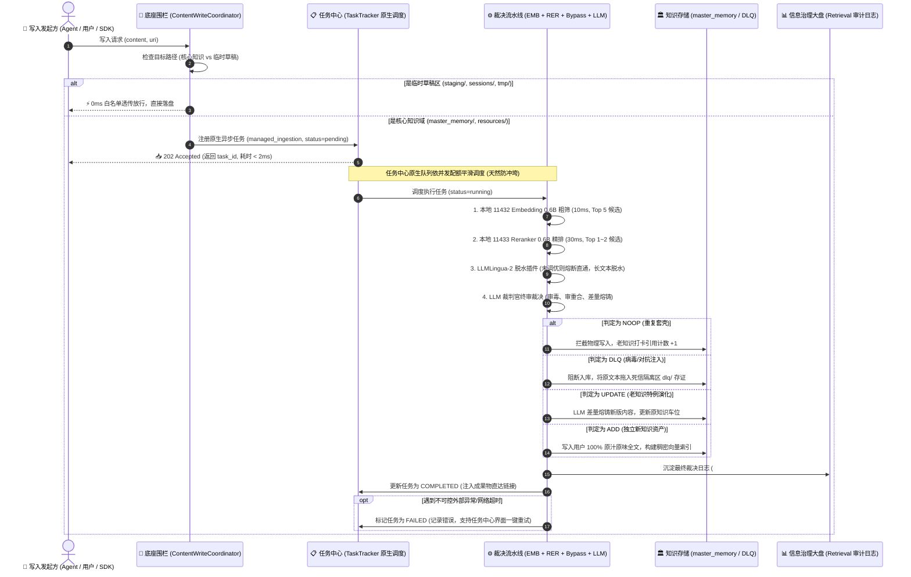

# 📥 异步托管入库流水线 (Managed Ingestion Pipeline) 与双轨架构规范 (SSOT)

> **文档状态**：正式架构规范 (Architecture SSOT)
> **所属版本**：`v1.4.70`
> **关联工单**：[`Card-Ingestion-01-ManagedPipeline`](../../REFACTORING_PLAN.md) ｜ [`Card-LLMLingua-01-GPU-Tuning`](../../REFACTORING_PLAN.md)
> **关联模块**：`openviking/storage/content_write.py`, `openviking/service/task_tracker.py`, `openviking/service/entropy_gatekeeper.py`, `src/routes/tasks/`, `src/routes/retrieval/`

---

## 一、 背景与第一性原理 (Context & First Principles)

### 1. 核心物理痛点

在传统的知识库写入中，前台往往采用“同步阻塞式写入”：

1. **时延雪崩**：当写入内容需要经过复杂的向量化、重复度探测与大模型质检时，单次写入耗时可达 3~10 秒，极易引发 HTTP 客户端超时死锁；
2. **围栏缺口与后门偷跑**：此前门禁逻辑仅挂载在顶层 REST API 和单个 MCP 工具上，底层文件系统、会话记忆抽取、批量导入工具能够绕过门禁直接向物理磁盘倒垃圾，导致知识库陷入严重的向量熵增；
3. **各自为政与重复造轮子**：尝试在业务模块中自研私有队列（Queue）、私有 Worker 线程和私有 WAL 文件，不仅违背奥卡姆剃刀，而且与任务中心既有的排队、重试、断电自愈机制发生严重冲突，导致任务中心瘫痪。

### 2. 第一性原理解决方案

将入库解构为**“前台极速受控接管，后台任务中心原生调度，底座物理单点封死，数据面日志透明审计”**的闭环：

- **前台极速交接 (<2ms)**：司机（调用方）提交数据，系统完成预校验后立即返回 `202 Accepted` 与 `task_id`，前台完全无感知、零等待；
- **底座围栏全面封堵 (Choke Point)**：在底座唯一落盘点 `ContentWriteCoordinator` 处收口，所有外部写入通道（REST、MCP write/edit/remember、add_resource）凡是写入核心知识域，无一例外必须接入流水线；临时工作区则 0ms 白名单放行；
- **任务中心原生驱动 (Control Plane)**：100% 依托 `TaskTracker` 原生轮子，自然获得排队防并发冲垮、SQLite 持久化灾备、错误堆栈留存与一键重试（Retry）能力；
- **信息治理结果大盘 (Data Plane)**：任务中心管“跑的过程与重试”，信息治理管“判的业务结果与演进日志”，职责彻底解耦。

---

## 二、 系统全链路架构与时序 (System Architecture)



---

## 三、 四类数据流向业务契约 (Four-Way Triage SSOT)

| 判定动作                       | 业务物理定义                                                                     | 知识库存储动作                                                                                 | 任务中心展示                                      | 信息治理展示                                 |
| :----------------------------- | :------------------------------------------------------------------------------- | :--------------------------------------------------------------------------------------------- | :------------------------------------------------ | :------------------------------------------- |
| **`NOOP`**(印证去重)   | 内容与已有知识命题完全一致 ($Sim \ge 0.95$)，属于重复复读或相同事实印证。      | **拦截物理落盘**，给既有老知识累加引用打卡计数，零占磁盘新车位。                         | 状态：`COMPLETED`摘要：印证去重，老知识打卡     | 胶囊：`印证去重`展示节约字节与老知识 URI   |
| **`UPDATE`**(差量熔铸) | 内容与已有知识高度同源 ($0.88 \le Sim < 0.95$)，但补充了反例特例或新边界条件。 | **原位差量演进**，由 LLM 将新特例与老知识熔铸为一份更严谨的知识。                        | 状态：`COMPLETED`摘要：特例演化，差量合并       | 胶囊：`特例演化`展示版本演进链与合并差异   |
| **`ADD`**(新资产入库)  | 具备独立新命题、高信息密度且无对抗攻击的全新真理事实。                           | **正式车位建档**，将司机的**100% 原始全文**写入 `master_memory` 并建立向量索引。 | 状态：`COMPLETED`摘要：新资产入库，索引就绪     | 胶囊：`新增写入`展示新 URI 与 L0/L1 摘要   |
| **`DLQ`**(死信拦截)    | 识别出提示词注入攻击 (Prompt Injection)、上下文炸弹或恶意虚假事实。              | **物理阻断入库**，将原始文本与拦截特征写入 `~/.openviking/data/dlq/` 隔离存档。        | 状态：`COMPLETED`摘要：识别安全威胁，已死信隔离 | 胶囊：`死信隔离`红字展示拦截原因与特征日志 |

---

## 四、 关键技术细节与质量防线 (Quality Guardrails)

### 1. 微软开源顶级轮子 LLMLingua-2 (xlm-roberta) 的接入准则

为坚决贯彻“绝不降低质量、绝不过度工程”的底线：

- **三大不可逾越的铁律**：
  1. **入库原文 100% 物理无损**：脱水算法仅用于给 LLM 裁判官准备临时对比草稿，最终存入 `master_memory` 的必须是用户提交的原始物理全文，知识表达力零损失；
  2. **代码与配置物理硬冻结**：通过正则物理冻结 YAML 头部（`^---[\s\S]*?---`）与代码块（`` ```[\s\S]*?``` ``），且固化 `threshold=0.35` 保护逻辑控制词；
  3. **短文本 (< 300 字符) 熔断透传**：短句完全绕过压缩，杜绝大炮打蚊子引入的细微语义漂移；
- **渐进式演进策略**：
  在本次主线中留出标准化插件接口，当前默认直通（Bypass）；下一步在 `Card-LLMLingua-01-GPU-Tuning` 中加载至 2080Ti GPU 富余的 9GB 显存中，经实测完全无损后正式合上开关。

### 2. 任务中心防冲垮与自愈机制

- **排队漏桶防冲垮**：依托 `TaskTracker` 原生队列配额，无论突发提交多少文档，后台严格按并发度（默认 2~4）平滑消费，彻底杜绝冲垮外部大模型 API；
- **断电自愈**：利用 SQLite 底层事务存储，服务重启时自动扫描 `PENDING` 态任务进行调度自愈，消灭私有 WAL 碎片；
- **错误排查与一键重试**：遇到外部 API 网络波动，任务中心置为 `FAILED` 并保留详细 Traceback，用户可在界面一键点击“重新发起”，重新触发裁决流程。

### 3. 写后即读奥卡姆剃刀

- 遵循用户指示，暂缓引入复杂的跨表暂存池，避免过度工程化；
- 后续若在真实高频调用中发现强一致性写后即读需求，再立项推进带特殊标记的状态池。

---

## 五、 控制面与数据面解耦规范

- **任务中心 (Tasks Center - 控制面)**：
  - 路由：`/tasks`
  - 核心组件：`TasksTable`, `TasksFilterBar`, `TaskDetailSheet`
  - 核心指标：任务状态、排队数量、执行耗时、失败一键重试、成果物直达链接。
- **记忆治理 (Memory Governance - 数据面)**：
  - 路由：`/retrieval`（大屏下半区）
  - 核心组件：`GatekeeperAuditStream` (记忆治理流水), `GatekeeperDecisionDrawer` (治理依据抽屉), `GatekeeperMetricsCard` (治理统计卡片)
  - 核心指标：治理流水号 `#dec_xxxx` / `#cry_xxxx`、动作分类统计、余弦相似度分布、节约磁盘字节数、历史匹配或被熔铸碎片 URI。
- **两端无缝贯通**：
  - 任务中心表格的成果物操作列中，增加【🔗 治理流水】按钮，点击自动联动打开记忆治理对应的决策详情抽屉。

---

## 六、 轻量增量入库、质量门禁工序插槽与快慢双轨算子引擎架构 (Dual-Track Quality Gate SSOT)

### 1. 领域概念三层清晰解耦

在系统架构和领域建模上，彻底消灭“概念倒错”与“层级混淆”，理清三层正交关系：

| 层次维度             | **任务层 (Task Level)**                  | **工序层 (Pipeline Step Slot)**          | **算子引擎层 (Operator Engine Driver)**            |
| :------------------- | :--------------------------------------------- | :--------------------------------------------- | :------------------------------------------------------- |
| **概念实体**   | **`轻量增量入库`** (`valet_parking`) | **`质量门禁`** (`step_quality_gate`) | **快慢双轨算子** (`Fast-Track` / `Slow-Track`) |
| **关注点**     | 业务生命周期与调度视角                         | 流水线编排与时序推进视角                       | 底层物理计算、算力与算法实现视角                         |
| **回答的问题** | “用户或 Agent 触发了一个什么性质的任务？”    | “该任务流水线当前推进到哪一道工序关卡？”     | “底层是谁在算？用模型还是向量？耗时与阈值是多少？”     |
| **系统表现**   | 任务大盘独立行、任务类型筛选标签               | 流水线全景图或工序明细中的步骤节点             | 后台具体服务类与模型驱动器 (`EntropyGatekeeper` 等)    |

### 2. 快慢双轨算子引擎分流架构

工序是插槽（What & When），算子引擎是插在里面的动力马达（How & Compute）。在【质量门禁】工序背后，分化出快慢双轨算子引擎：

```
                    ┌─────────────────────────┐
                    │ 工序：质量门禁 (Slot)   │
                    └────────────┬────────────┘
                                 │
                 根据任务类型/数据特征动态路由
                                 │
         ┌───────────────────────┴───────────────────────┐
         ▼                                               ▼
┌─────────────────────────┐             ┌─────────────────────────┐
│  ⚡ 快轨算子 (Fast Track) │             │  🧠 慢轨算子 (Slow Track) │
├─────────────────────────┤             ├─────────────────────────┤
│ • 耗时：< 10ms          │             │ • 耗时：300ms ~ 3s      │
│ • 算力：本地 2080Ti 探针 │             │ • 算力：大模型 (CPA/本地35B)│
│ • 逻辑：Hash比对 + 向量   │             │ • 逻辑：因果冲突判别、  │
│   余弦硬阈值(>=0.95截断) │             │   事实版本演进、深度去重│
│ • 适用：轻量增量入库     │             │ • 适用：大文件入库、    │
│   (保证 Agent 零等待)    │             │   会话记忆沉淀、快轨待裁决│
└─────────────────────────┘             └─────────────────────────┘
```

### 3. 全局多任务共用质量门禁工序插槽

不同顶层任务根据其业务场景，在进入【质量门禁】工序时自适应挂载对应算子：

1. **轻量增量入库 (`valet_parking`)**：
   - 核心工序流水线：`极速接管` ➔ `语义探针` ➔ `质量门禁` ➔ `数据落盘`；
   - 门禁挂载：默认挂载 **⚡ 快轨算子**，99% 的同义复读被毫秒级秒杀截断，保障 Agent 对话零感知等待；
   - 灰度降级：遇冲突边界（$0.88 \le Sim < 0.95$）标记后抛入后台慢轨精审。
2. **托管数据摄取 (`managed_ingestion`)** / **资源文件导入** / **会话记忆沉淀**：
   - 包含多道批处理工序，在质检阶段挂载 **🧠 慢轨算子**，调用大模型进行因果树修正与版本演化 (`Superseding DAG`)。

---

## 七、 全生命周期【记忆治理流水】统一总账架构与存量结晶线索设计 (Memory Governance Stream & Crystallizer SSOT)

### 1. 唯一领域定义：全生命周期记忆物理流变档案总账

系统彻底废弃带有中二色彩的“裁决流水”，统一收敛为工业级自解释专有名词：**「记忆治理流水」** (`Memory Governance Stream`)。

OpenViking 作为智能体体外大脑，其记忆中枢的物理变动天然由两大齿轮驱动：

1. **前门齿轮（增量准入治理 - Ingress Admission）**：
   - 包含 `轻量增量入库`、`资源处理`、`会话提交` 等任务车间；
   - 在【准入判定】工序把关外部知识准入，生成 `ADD` (新增)、`NOOP` (去重)、`UPDATE` (版本升级)、`DLQ` (对抗拦截) 判定。
2. **后院齿轮（存量结晶治理 - Stock Crystallization & Pruning）**：
   - 由 `存量知识结晶器` (`Card-Entropy-02-Crystallizer`) 任务车间驱动；
   - 专注于对存量散落记忆进行物理减熵，三门并联触发（数量门 $\ge 5\sim 10$ 篇、密度门余弦均值 $> 0.72$、稳定门 $\ge 24\text{h}$），将多个碎片提炼融铸为 1 个高纯度晶体，并将原始碎片物理归档移出活跃库。

**核心第一性原理**：
无论是增量准入还是存量结晶，其本质都是**“记忆库发生物理变动、事实演化与生命周期治理的过程”**。全系统必须将其统一沉淀于单一总账，确保任何知识的来龙去脉（从哪篇碎片融出来的、何时被推翻的、何时被去重的）全生命周期 100% 可审计、可溯源、可解剖。

### 2. 统一数据模型规范 (`GovernanceAuditRecord`)

底层审计流水物理收口于 `~/.openviking/data/entropy_gatekeeper.jsonl`（具备 30 天自动滚动修剪机制），数据结构全面对齐如下契约：

```typescript
export interface GovernanceAuditRecord {
  /** 唯一流水号：增量为 dec_xxxxxxxx，存量结晶为 cry_xxxxxxxx */
  id: string
  /** 治理时间戳 (秒级浮点数) */
  timestamp: number
  /** 来源车间/任务类型：valet_parking | add_resource | session_commit | crystallizer */
  source_workshop?: string
  /** 关联任务实例 ID (若由 TaskTracker 驱动) */
  task_id?: string
  /** 治理动作类型 */
  action: 'add' | 'update' | 'noop' | 'dlq' | 'crystallize' | 'archive' | 'prune'
  /** 治理动作作用的主体/产物目标 URI */
  uri: string
  /** 匹配到的既有节点 URI，或结晶熔铸的原始碎片 URIs 列表 */
  matched_uri?: string
  fragment_uris?: string[]
  /** 余弦相似度或结晶置信度 (0.0000 ~ 1.0000) */
  similarity: number
  /** 治理依据自解释 (Plain language why this action was taken) */
  reason: string
  /** 节约磁盘/向量计算开销字节数 (B) */
  saved_bytes: number
  /** 晶体或新知识的 L0/L1 摘要透传 */
  summary_snippet?: string
}
```

### 3. Studio 前端大盘交互与多维过滤

在 `/studio/retrieval` 页面下半区，治理流水表格提供工业级可观测体验：

1. **多维动作过滤药丸 (Filter Pills)**：
   - `全部` (All) ｜ `新增入库` (ADD) ｜ `印证去重` (NOOP) ｜ `特例演进` (UPDATE) ｜ `碎片结晶` (CRYSTAL) ｜ `失效归档` (ARCHIVE)
2. **存量结晶双向溯源抽屉**：
   - 点击 `#cry_xxxx` 结晶流水行，打开【晶体结构与溯源解剖抽屉】；
   - 左侧展示生成的全新晶体全文（L0 核心共识 + L1 证据链 + L2 反例哨兵）；
   - 右侧展示被熔铸归档的 5~10 篇原始碎片卡片列表，直观呈现“减熵前 vs 减熵后”的物理对比。
3. **任务中心双向直达**：
   - 在任务中心的任何任务详情中，点击工序【准入判定】或【结晶熔铸】交付物卡片，可秒级直达记忆治理流水的对应行。
