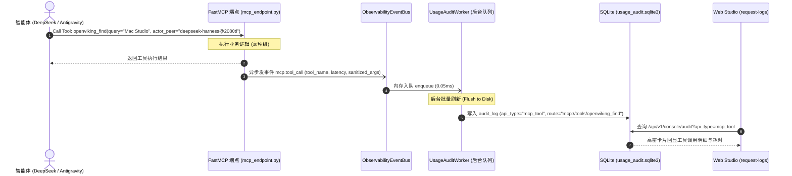

# 📡 FastMCP 工具调用统一在线审计与前端大盘透传规格书
> **SSOT 标识**: `docs/architecture/MCP_TOOL_AUDIT_LOG_UNIFICATION_SPEC.md`  
> **状态**: 方案已过审 ｜ 待迭代排期  
> **关联卡片**: Card-108 ~ Card-110 (`REFACTORING_PLAN.md`) ｜ **基准版本**: v1.7.62+

---

## 🧭 一、 现状物理真实验收：当前是否已实现？

### 结论：**尚未完整闭环（实现度约 50%）。**

| 模块分层 | 现状事实 | 是否已实现 | 差距与断链点 (Gaps) |
| :--- | :--- | :---: | :--- |
| **前端大盘** (`src/routes/request-logs/`) | 具备成熟的高密请求审计表格、分页、状态码与耗时回显。 | ⚠️ 基础具备 | 顶部 API 类型下拉菜单中**缺少 `mcp_tool` 专属过滤胶囊**；表格仅按 HTTP Method 展示，缺少 MCP 工具名与入参展示。 |
| **审计服务** (`usage_audit/`) | 具备异步写入队列 `UsageAuditWorker` 与 SQLite 存储 `SQLiteUsageAuditStore`。 | ⚠️ 基础具备 | `projection.py` 只投影了 `http.request` 事件，**未实现 `mcp.tool_call` 的事件消费与投影规约**。 |
| **FastMCP 执行层** (`mcp_endpoint.py`) | 30+ 原生工具完整可用，身份鉴权与 `actor-peer` 解析正常。 | ❌ 未实现 | **工具调用执行前后未触发任何审计事件**，没有向 `ObservabilityEventBus` 发送工具名、入参摘要、执行耗时与状态。 |

**一句话总结现状**：系统目前只能在前端看到 **REST API 请求（如 `/api/v1/search/find`）** 的审计，所有通过 stdio/SSE 发起的 **FastMCP 原生工具调用在前端在线日志中处于“完全隐形”状态**。

---

## 💡 二、 第一性原理：为什么必须接入并统一？

1. **分布式智能体协同的唯一“黑匣子”**：
   在多 Agent 环境（DeepSeek Harness、Antigravity、Cursor、远程卫星）中，智能体主要通过 FastMCP 工具（如 `openviking_find`、`openviking_store`、`openviking_skills`）与外脑交互。若缺少工具调用日志，系统便失去了最核心的**行为血统（Provenance）与定责能力**。
2. **极速远程诊断与白盒化**：
   当远程客户端调用工具返回 400（参数非法）或 500 时，开发者无需登录宿主机翻文件，直接在 Web Studio 即可秒级排查报错堆栈。

---

## ⚔️ 三、 查理·芒格逆向对抗审讯：四大必然死因与物理防线

为了保证此功能上线后**不拖慢主服务、不撑爆数据库、不泄露密码**，提前设立四道不可逾越的物理红线：

| 必然死因 (Failure Modes) | 破坏后果 | 物理防御铁律 (Engineering Safeguards) |
| :--- | :--- | :--- |
| **死因 1：长文本 Payload 撑爆 SQLite 与前端 DOM** | 某些写入工具 (`openviking_write`) 或大检索入参长达数万字，如果 1:1 原文全量存入日志，日志表几周内膨胀几十 GB，前端分页渲染直接卡死。 | **【入参/出参硬截断与脱水】**：入参仅提取核心特征字段（`uri`, `query`, `path`），大文本内容截断保留前 300 字符；返回值只记录状态、命中数与字节数，绝不全量存原文。 |
| **死因 2：敏感凭据在前端大盘裸奔泄密** | 智能体在调用工具时传入了环境变量、API Key 或数据库密码，直接明文入库并呈现在 Web 界面。 | **【前置强制动态脱敏】**：事件入库前无条件穿透 `PrivacyMasker`，将敏感特征强制替换为 `sk-***[MASKED]***`。 |
| **死因 3：同步写日志拖慢工具调用 (Latency Regression)** | 每次工具执行都在同步等待写 SQLite，导致 MCP 响应增加 5~20ms 延迟，甚至引发 SQLite busy 锁竞争。 | **【CQRS 读写分离与异步入队】**：工具执行完毕后，仅向内存 `asyncio.Queue` 投递轻量事件（耗时 <0.05ms），由后台守护线程批量写入，主调用零等待。 |
| **死因 4：高频内部轮询造成日志垃圾刷屏** | 某些本地探针（如每 5 秒 ping 一次系统状态）高频产生日志，瞬间淹没真正有价值的智能体业务调用。 | **【受控白名单与高频探针静音】**：对高频只读心跳探针（如 `openviking_ping`）默认开启静音过滤，仅保留关键业务工具调用。 |

---

## 🏗️ 四、 架构数据流与字段契约 (Schema & Flow)

### 统一审计数据模型对齐契约 (Audit Log Mapping)
将 MCP 工具调用映射为现有 `audit_log` 字段：
- `request_id`: 工具调用唯一 ID（如 `mcp_call_xxxx`）
- `account_id`: 租户 ID（默认 `default`）
- `user_id`: 关联用户 ID
- `method`: 统一标记为 `"CALL"`（或 `"TOOL"`）
- `route`: 规范化为 `"mcp://tools/{tool_name}"`（如 `mcp://tools/openviking_find`）
- `api_type`: 标记为 `"mcp_tool"`（区分于 `"rest_api"`）
- `status_code`: 成功标记 `200`，客户端参数错误 `400`，底层异常 `500`
- `duration_ms`: 真实工具执行耗时（浮点数毫秒）
- `error_code` / `error_message`: 真实捕获的异常信息
- `error_details`: 序列化后的脱水入参摘要（截断 $\le 300$ 字符）与 Peer 来源（`actor_peer`）

---

## 🎯 五、 原子化任务卡片拆解 (Tracer Bullet Tasks)

| 任务工单 ID | 版本规划 | 模块与重构主题 | 核心交付物与物理验收门禁 |
| :--- | :---: | :--- | :--- |
| **Card-108** | `v1.7.62` | **FastMCP 工具调用执行切面与异步事件总线发射器** | 1. 在 `mcp_endpoint.py` 工具分发入口增加统一环绕拦截切面； 2. 工具执行完成后异步发射 `mcp.tool_call` 事件至 `ObservabilityEventBus`； 3. 0 线程挂起，主调用延迟增量 $\le 0.1\text{ms}$； 4. 专项单测覆盖工具正常执行与异常捕获。 |
| **Card-109** | `v1.7.63` | **UsageAudit 投影层 MCP 规约与脱水脱敏流水线** | 1. 在 `projection.py` 补齐 `_project_mcp_tool_call` 转换器； 2. 挂载 `PrivacyMasker` 动态脱敏，硬截断超大 Payload（$\le 300$ 字符）； 3. 数据库原子持久化至 `audit_log`（标记 `api_type="mcp_tool"`）； 4. 专项单测验证超大参数防爆与密钥自动打码。 |
| **Card-110** | `v1.7.64` | **Web Studio 审计大盘 MCP 工具分类与参数详情抽屉** | 1. 前端 `/request-logs` 顶部 API 类型下拉增加 `MCP 工具` 筛选胶囊； 2. 增加高密工具调用卡片与参数详情抽屉； 3. 严守 NO GREEN EVER 🚫 与 $\ge 12\text{px}$ 规范； 4. 前端打包 PASS，Vitest 门禁全绿。 |
