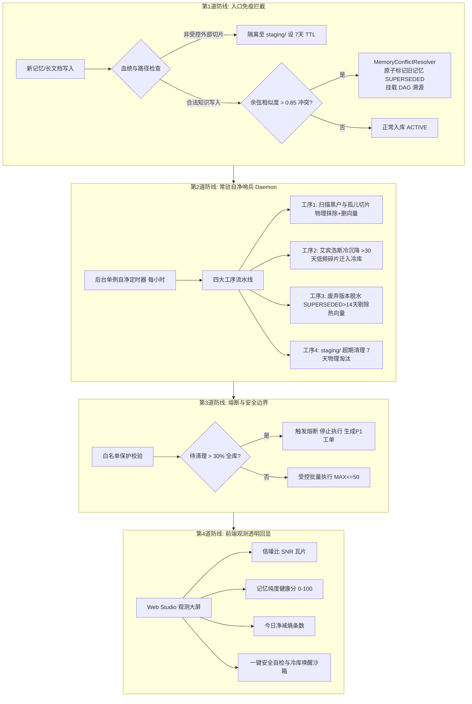

# 🧬 OpenViking 体外大脑“自净本能”全息架构规划与逆向抗压规格书
> **SSOT 标识**: `docs/architecture/MEMORY_AUTONOMIC_PURIFICATION_SPEC.md`  
> **指导思想**: 基于查理·芒格逆向对抗审讯（倒推死因）、第一性原理（物理根因）、鲁棒性熔断门禁与奥卡姆剃刀（如无必要勿增实体）。  
> **关联卡片**: Card-104 ~ Card-107 (`REFACTORING_PLAN.md`) ｜ **基准版本**: v1.7.58+

---

## 🧭 一、 第一性原理：体外大脑为什么会变“脏”？

### 1. 物理本质定义
体外大脑（OpenViking / Wiki）的物理本质是**智能体跨会话、跨集群共享的高信噪比语义外脑**。
如果一个外脑只具备“吸纳”本能而缺乏“代谢与免疫”本能，随着时间与交互次数的推移，它不可避免地会遵循**热力学第二定律走向最大熵增**——沦为一个充斥着陈旧假说、死循环报错、临时调试流水账与第三方长文碎片的“垃圾填埋场”。

### 2. 脏记忆的三大物理根因 (Root Causes)
1. **输入端黑户渗透 (Ingress Orphan Flooding)**：外部长文档或脚本批量导入时，直接写入底层磁盘路径，未在 `MemoryLifecycleStore` 状态机登记，绕过生命周期管理，成为永久 ACTIVE 的僵尸切片（如 644 个 `paperclip_doc_*` 孤儿切片）；
2. **事实漂移与陈旧沉淀 (Epistemic Drift & Stale Ground Truth)**：早期的临时推论、故障诊断或旧版本 API 在客观物理世界已经发生变化（如节点状态恢复、API 重构），但其历史文本仍以高余弦相似度驻留在 VectorDB 中，每次检索依然被召回并污染系统 Prompt（如 Mac Studio 误判退役）；
3. **物理与向量双轨脱节 (Vector-Filesystem Desynchronization)**：物理文件删除后未同步剔除向量索引，或反向产生悬空向量，导致“幽灵召回 (Phantom Recall)”。

---

## ⚔️ 二、 查理·芒格逆向对抗审讯：倒推自净系统的四大死因

> *“如果我知道我会在哪里死去，我就永远不去那个地方。” —— 查理·芒格*

为了设计一套真正坚如磐石的自净系统，我们首先假设**自净系统上线后彻底失败崩溃**，反推其必然死因并针对性布防：

| 假设死因 (Failure Mode) | 发生机制与破坏后果 | 芒格逆向审讯结论与物理防御铁规 |
| :--- | :--- | :--- |
| **死因 1：大模型自主裁决导致自毁 (LLM Autonomous Over-Pruning)** | 如果让大模型每隔几分钟用 Prompt 自主判断哪些记忆该删，模型的随机幻觉与语义漂移迟早会将核心架构决策或关键演进教训“自作聪明”地当成垃圾删除。 | **【绝对确定性规则优先】**：严禁由非确定性 LLM 掌控物理删除生杀大权！记忆的淘汰降级必须以确定性物理路径、时间衰减公式、余弦硬阈值和状态机规则为主，LLM 仅用于离线摘要提纯。 |
| **死因 2：雪崩式误删缺乏熔断 (Blast Radius Explosion)** | 自净扫描脚本或状态机出现一个空指针或正则表达式缺陷，导致单次把全库 100% 记忆清空。 | **【单次熔断与爆炸半径钳位】**：设立 `MAX_BATCH_PRUNE = 50` 物理硬上限。若单次扫描待清理量超过全库 30%，触发系统熔断，物理阻断清理，自动生成 P1 工单等待人类介入。 |
| **死因 3：不可逆裸删导致绝版资产灭失 (Irreversible Hard Deletion)** | 只要误判一条历史关键代码推导，物理 `rm` 后再无找回可能。 | **【软降级与冷存储先行】**：除绝对黑名单规则的第三方垃圾切片可物理抹除外，任何语义记忆一律先流转为 `SUPERSEDED` 或移入 `memory_cold_archive.db` 冷库，热向量库脱水，文本永久安全可逆（秒级一键 Revive）。 |
| **死因 4：后台守护进程耗死宿主机 (Resource Exhaustion by Daemon)** | 引入过重的定时轮询或沉重管道，常驻高频跑全库向量余弦碰撞，导致 CPU 100%、锁死 SQLite、拖垮主服务。 | **【单调时钟轻量自驱与闲时触发】**：继承核心服务优先级铁律，哨兵作为异步次要仆人，执行频次收敛为 1 小时/次，带系统负载自检（CPU < 20% 才动），单次执行控制在 300ms 内。 |

---

## 🪒 三、 奥卡姆剃刀与鲁棒性剪枝

### 1. 奥卡姆剃刀：如无必要，勿增实体
- ❌ **坚决切除**：不引入 Celery、不引入 Redis、不引入外部 sidecar 守护进程、不引入重量级日志监控服务（如 ELK/Loki）；
- ✅ **极简闭环**：完全内嵌于 OpenViking 原生主进程生命周期，复用 Python 原生守护线程单例；数据状态收敛于 SQLite 单一真相源。

### 2. 绝对免疫白名单 (Immutable SSOT Vault)
以下目录与资产具备**最高物理免疫权**，任何自净程序与算法**绝对禁止降级、篡改或删除**：
1. `viking://resources/master_memory/evolution_lessons/`（演进教训）
2. `viking://resources/master_memory/crystals/`（主知识卡片）
3. `viking://resources/master_memory/skills/`（官方与现役技能）
4. Frontmatter 中带有 `immutable: true` 或 `keep: permanent` 的语义记忆。

---

## 🛡️ 四、 四层免疫纵深自净架构 (Four-Layer Immune Architecture)

---

## 🧩 五、 现有工程资产深度复用矩阵 (Living Asset Reuse)

坚决贯彻“能复用必复用，绝不闭门造车”原则，自净本能系统 100% 建立在现有成熟资产之上：

| 现有轮子与模块 | 物理文件路径 | 在自净体系中的复用角色与职责 |
| :--- | :--- | :--- |
| **`MemoryConflictResolver`** | `openviking/service/memory_conflict_resolver.py` | 负责新旧冲突时原子化降级旧记忆为 `SUPERSEDED` 并绑定 DAG 追溯链条。 |
| **`MemoryColdArchiveService`** | `openviking/service/memory_cold_archive_service.py` | 负责将衰减分数低于 0.35 的记忆迁移至 `memory_cold_archive.db`，并提供无损 `revive` 复活。 |
| **`MemoryLifecycleStore`** | `openviking/service/memory_lifecycle_fsm.py` | 作为全库记忆状态机的唯一物理真相源 (SSOT)，维护 ACTIVE / SUPERSEDED / COLD 状态。 |
| **`MemoryPurityBenchmark`** | `openviking/service/memory_purity.py` | 提供 SNR、冲突率、新鲜度及 0~100 综合纯度分的客观数学度量。 |
| **`VikingFS` & `VectorStore`** | `openviking/storage/` | 负责物理文件与热向量索引的原子双清。 |

---

## 📊 六、 前端客观数据指标锚定 (Frontend Metric Anchor)

依据 Fork 立足之本，任何自净改动必须在 Web Studio 上有明确的指标回显，严禁黑盒交付：

1. **记忆信噪比 (Memory SNR Ratio)**：$\frac{\text{权威核心记忆数}}{\text{全库记忆总数（含碎片/废弃）}} \times 100\%$，基线 ~28%，目标 $\ge 90\%$；
2. **纯度综合健康分 (Purity Health Score)**：由 `MemoryPurityBenchmark` 实时计算（0 ~ 100 分），低于 60 分呈现琥珀告警；
3. **今日净减熵条数 (Net Entropy Reduced)**：自净哨兵今日自动清理/归档的无效碎片总数；
4. **未决认知冲突数 (Unresolved Conflicts)**：存在相反或争议推论的记忆对数，自净目标为 `0`。

---

## 🎯 七、 原子化任务拆解矩阵 (Tracer Bullet Tasks)

| 任务工单 | 版本规划 | 模块与主题 | 验收门禁 (Gates) |
| :--- | :---: | :--- | :--- |
| **Card-104** | `v1.7.58` | **存量孤儿切片物理大扫除与向量库深度同步** | 磁盘清退 644 个 `paperclip_doc_*` 及 57 个匿名哈希遗留目录；向量库同步剔除；`openviking_find("paperclip")` 彻底返回 0 条。 |
| **Card-105** | `v1.7.59` | **常驻自净巡检哨兵引擎 (MemoryPuritySentinel)** | 落地单例低开销守护线程，串联孤儿清除、艾宾浩斯冷存、冲突脱水、staging TTL；通过 100% 覆盖单测与熔断测试。 |
| **Card-106** | `v1.7.60` | **入口级实时免疫门禁与血统拦截 (Ingress Guard)** | 拦截未经生命周期登记的外部长切片，防范黑户复发；相似度 >0.85 自动级联降级旧知识。 |
| **Card-107** | `v1.7.61` | **Web Studio 观测大屏自净态势瓦片与沙箱** | 前端回显 SNR、Purity Score、净减熵数；提供一键 Dry-run 自检与冷库一键 Revive 交互。 |
