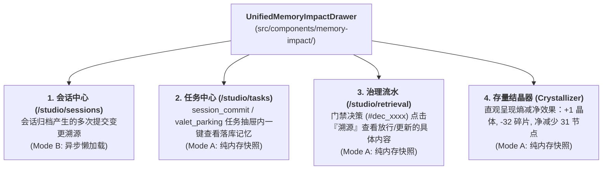

# OpenViking 会话演进模型、沙盘与会话中心解耦及记忆影响白皮书 (Session Evolution & Memory Impact Spec)

> **物理真相源标识**：`OpenVikingStudio/docs/architecture/SESSION_EVOLUTION_AND_MEMORY_IMPACT_SPEC.md`  
> **版本**：v1.0 (2026-09-10)  
> **关联工单**：`Card-Tasks-Stage2.3-QualityGateChain` (v1.4.82), `Card-Entropy-02-Crystallizer` (v1.4.83), `Card-Knowledge-Scaffolding-Loop` (v1.5.x)

---

## 一、 会话从生肉到晶体的三层演进模型 (Three-Tier Evolution Architecture)

系统在处理跨环境、跨节点的会话与记忆交互时，严格遵循三层物理漏斗：

```
[Antigravity IDE]   [OpenClaw 多智能体]   [3070 卫星节点]   [Mac Studio M3]
        │                   │                   │              │
        └───────────────────┴─────────┬─────────┴──────────────┘
                                      ▼
             【第一层：暂存汇流区 (Staging & Session Pool)】
      - 物理路径：viking://resources/staging/ 与 /api/v1/sessions
      - 运行状态：100% 在线运行
      - 准入策略：Stage 0 白名单放行（0 算力开销，直接放行入库，绝不阻塞前端与交互）
      - 物理定位：黑匣子 / 行车记录仪存证，保障对话数据 100% 不丢失
                                      │
                                      ▼ (异步触发 session_commit 流水线)
             【第二层：提纯质检工序 (Session Commit & Quality Gate)】
      - 运行状态：当前半自动化，正在通过 Card-Tasks-Stage2.3 规范化
      - 核心工序：
        1. 准入判定 (Admission Check)：字数过滤、寒暄过滤、无技术命题过滤，0 Token 归档；
        2. 质量门禁 (Quality Gate)：经由大模型榨出 5 维正交记忆（cases, entities, events, experiences, trajectories）；
        3. 记忆影响评估 (Memory Impact)：计算 Git-like Diff（新增、更新、删除）。
                                      │
                                      ▼ (存量积累触发三门结晶)
             【第三层：全局主记忆与知识晶体 (Master Memory & Crystallizer)】
      - 物理路径：viking://resources/master_memory/ 与 crystals/{topic}.md
      - 运行状态：100% 在线运行（结晶引擎正在排期推进）
      - 核心机制：三门并联触发（数量门 >= 5, 余弦密度 > 0.72, 沉淀时间 >= 24h），将分散碎片熔铸为权威知识晶体，旧碎片归档，活跃节点物理净减少。
```

---

## 二、 交互沙盘 (Playground) vs 会话中心 (Sessions) 深度对比

官方在 Studio 中设计了两个看似都包含“会话”的页面，其第一性原理完全不同：

| 评估维度 | 交互沙盘 (`/studio/playground`) | 会话中心 (`/studio/sessions`) |
|:---|:---|:---|
| **核心定位** | **开发者单点调试工作台 (Workbench / Sandbox)** | **生产级会话总线与记忆审计大盘 (Production Hub)** |
| **页面布局** | 三栏响应式：左侧文件树 + 中间预览/搜索 + 右侧终端/测试 Agent | 双栏高密：左侧全量会话流 + 右侧完整多轮问答与记忆影响 |
| **会话性质** | 本地临时调试、验证 Prompt 或测试某文件召回效果的沙盒 | 各种客户端、Agent、定时任务与交互产生的真实生产会话 |
| **会话持久化** | 仅记录在沙盘专属的 `localStorage` 历史中（防生产污染） | 全量落盘持久化至 SQLite / QueueFS，支持 1,000+ 条分页拉取 |
| **核心联动** | 与左侧文件树直接联动（如：针对选中的某个资源提问） | 与右上角 **【记忆影响 (Memory Impact)】** 抽屉强联动 |
| **工程类比** | 类似于 Postman / Swagger 的**“单接口快速测试面板”** | 类似于生产系统的**“调用日志、审计追踪与数据流大盘”** |

---

## 三、 “记忆影响 (Memory Impact)” 底层运行机制

### 1. 什么是“记忆影响”？
在传统的 Agent 系统中，一次对话后“大模型到底记住了什么、改了哪些记忆”通常是一个完全不可见的黑盒。  
OpenViking 借鉴了现代版本控制系统（Git Commit）的思想，发明了 **“记忆影响（Memory Impact）”** 机制：
**每一次会话提纯（`session_commit`）产生的记忆变更，都会被记录为一个类似 Git Commit 的快照（如 `archive_001`），并计算出物理 Diff（`+4 新增` / `✎ 1 更新` / `- 0 删除`）。**

### 2. 五维正交记忆空间体系 (5-Dimensional Taxonomy)
提取器在分析会话后，将信息精细解构为 5 个正交维度，分别落盘至 `viking://user/default/memories/`：

1. **`events` (事件记忆)**：
   - *定义*：按时间发生的事实流水；
   - *落地路径*：`memories/events/YYYY/MM/DD/{事件名}.md`；
   - *范例*：`memories/events/2026/08/31/ECS全拓扑架构梳理.md`。
2. **`cases` (案例与排障库)**：
   - *定义*：遇到什么问题、原因是什么、解决步骤是什么（SOP）；
   - *落地路径*：`memories/cases/{案例名}.md`；
   - *范例*：`memories/cases/ECS反向代理隔离规范.md`。
3. **`trajectories` (轨迹记忆)**：
   - *定义*：本次任务中 Agent 的思考步骤、工具调用链路与因果决策；
   - *落地路径*：`memories/trajectories/{任务名_时间戳}.md`；
   - *范例*：`memories/trajectories/ECS架构梳理_20260831183554.md`。
4. **`experiences` (经验与规则库)**：
   - *定义*：从案例中抽象出的高阶经验、铁律与最佳实践；
   - *落地路径*：`memories/experiences/{经验名}.md`；
   - *范例*：`memories/experiences/阿里云ECS双拓扑双代架构梳理.md`。
5. **`entities` (实体知识字典)**：
   - *定义*：系统物理节点、服务端口、人员、硬件的静态配置与元数据；
   - *落地路径*：`memories/entities/{分类}/{实体名}.md`；
   - *范例*：`memories/entities/基础设施/llama.cpp_wsl_部署.md`。

### 3. 对我们记忆系统的深远影响
- **透明度与可解释性 100%**：人类开发者在会话中心一眼就能看出本次会话沉淀了哪些事实，支持逐条审查与回滚；
- **定向精准召回**：后续检索时，系统可以区分是找“运维 SOP (cases)”、还是查“硬件配置 (entities)”、还是复查“决策依据 (trajectories)”，大幅提升召回信噪比；
- **防膨胀防线（结晶的原料库）**：记忆影响生成的这五类文件，正是后续 **`Card-Entropy-02-Crystallizer` (结晶器)** 的标准原料来源！当某类实体或经验碎片积累超过 5 条时，触发结晶熔铸，实现终极减熵。

---

## 四、 后续迭代演进计划 (Roadmap & Action Plan)

1. **`Card-UI-UnifiedMemoryImpactWheel` (计划版本 `v1.4.82`)**：
   - 将原本深埋在会话中心的“记忆影响 (Memory Impact)”抽屉彻底解耦下沉为系统级通用组件 `src/components/memory-impact/`；
   - 支持受控快照与异步懒加载双模态，并在四大场景（会话、任务中心、信息治理流水、存量结晶器）全量复用；
   - 物理收敛单文件至 100~250 行黄金甜点区，修复 `< 11px` 微字与 NO GREEN 视觉缺陷。
2. **`Card-Tasks-Stage2.3-QualityGateChain` (计划版本 `v1.4.83`)**：
   - 将「准入判定 (Admission Check)」与「质量门禁 (Quality Gate)」作为标准工序插槽，正式挂接至 `session_commit` 与 `add_resource` 任务流水线；
   - 彻底解决 Staging 堆积、缺乏全自动准入与提纯的问题，并直接复用记忆影响轮子呈现任务影响。
3. **`Card-Entropy-02-Crystallizer` (计划版本 `v1.4.84`)**：
   - 部署三门并联结晶器（数量门、密度门、时间门），将记忆影响沉淀出的分散碎片熔铸为权威知识晶体，旧碎片自动无损归档；
   - 复用通用记忆影响轮子，直观展示“+1 晶体, -N 碎片”的物理净减熵成果。
4. **`Card-Knowledge-Scaffolding-Loop` (计划版本 `v1.5.x`)**：
   - 召回未命中频次漏斗，自动铸造待补全知识骨架卡片，由工兵 Agent 或人类异步填空补齐。

---

## 五、 通用记忆增量审计快照轮子 (Universal Memory Impact Wheel) 解耦架构

### 1. 核心推导背景：从“局部私有抽屉”到“全局通用轮子”
在官方原版设计中，`MemoryImpact` 被私有实现于 `src/routes/sessions/-components/memory-impact.tsx`（393 行）。该实现存在三大致命缺陷：
1. **强行绑定会话领域模型**：组件入参仅接受 `session?: SessionMeta`，在内部隐式发起 `/api/v1/sessions/...` 网络调用，导致其他需要展示记忆 Diff 的页面（任务中心、治理流水、结晶器）完全无法复用；
2. **单文件膨胀违背黄金甜点区**：393 行代码将指标卡片、分类 Tab、展开行、前后内容 Diff 与日期格式化混杂在单一文件，逼近 400 行预警线；
3. **视觉排版细微瑕疵**：折叠箭头带有 `text-[10px]` 违规微字，且缺乏纯内存快照渲染的受控模式。

### 2. 第一性原理物理契约 (Pure Data-Driven Diff Engine)
无论触发源是会话提交、后台泊车入库、门禁裁决写入还是存量结晶，对 VikingFS 产生的物理影响均严格等价为**“资源增量变更原子操作集 (Memory Mutation Traces)”**：

```ts
export type UniversalMemoryDiffKind = 'add' | 'update' | 'delete'

export interface UniversalMemoryDiffOperation {
  kind: UniversalMemoryDiffKind
  uri: string                          // 资源物理定位 (viking://...)
  memoryType: string                   // 领域类型 (events, cases, crystals, entities...)
  before?: string                      // 变更前快照
  after?: string                       // 变更后正文
}

export interface UniversalMemoryDiff {
  id: string                           // 快照 ID (如 commit_001, #dec_xxxx, #cry_xxxx)
  uri?: string                         // 关联归档资源路径
  timestamp?: string                   // 生成时间戳 (ISO 8601)
  operations: UniversalMemoryDiffOperation[]
  summary: {
    adds: number
    updates: number
    deletes: number
  }
}
```

### 3. 一石四鸟：四大业务复用场景拓扑



### 4. 高内聚组件拆分架构 (100~250 行黄金甜点区)
下沉至公共组件库 `src/components/memory-impact/`：
- `types.ts` (~50 行)：通用强类型 DTO 契约；
- `impact-summary-cards.tsx` (~80 行)：新增(cyan-600)/更新(amber-600)/删除(rose-600) 三态高密指标卡片，严格践行 NO GREEN EVER；
- `memory-diff-item.tsx` (~130 行)：单条 URI 展开详情、Badge 标注与变更前后 Diff 视图，修复 `< 11px` 微字缺陷；
- `memory-impact-drawer.tsx` (~160 行)：主抽屉容器，支持 Tab 分类过滤、受控快照模式 (Controlled) 与异步懒加载模式 (Lazy Query)；
- `index.ts` (~20 行)：统一聚合导出；
- `src/routes/sessions/-components/memory-impact.tsx`：精炼为 15 行轻量适配器，100% 向后兼容，零破坏原页面。

